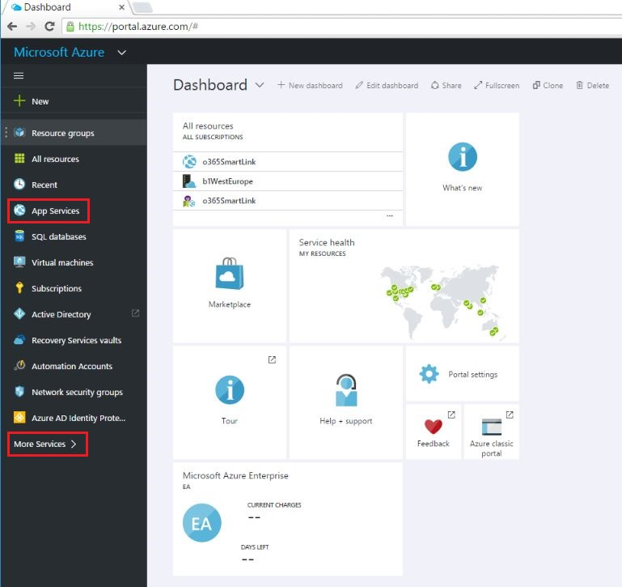
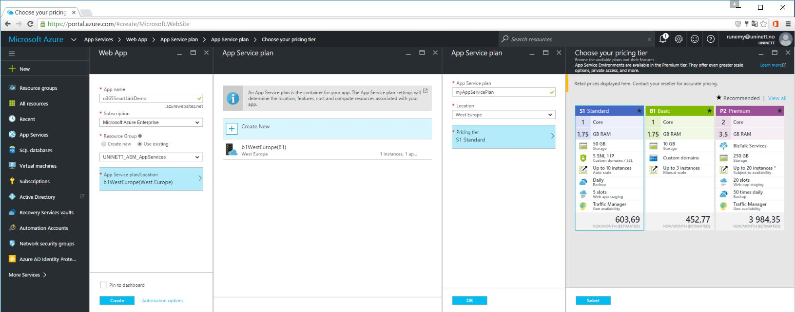
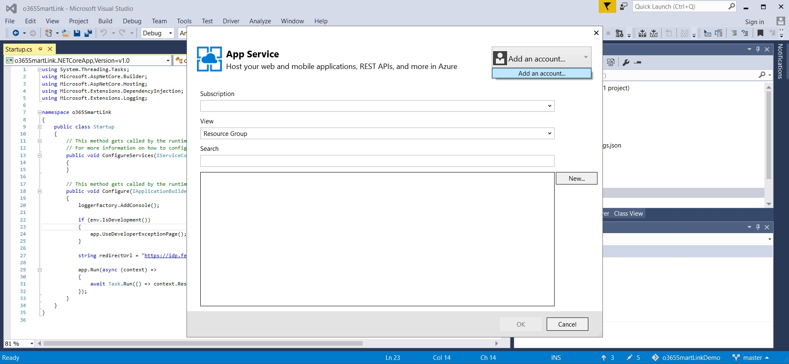
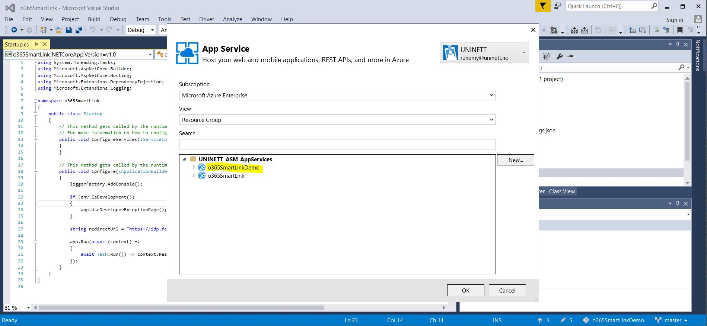
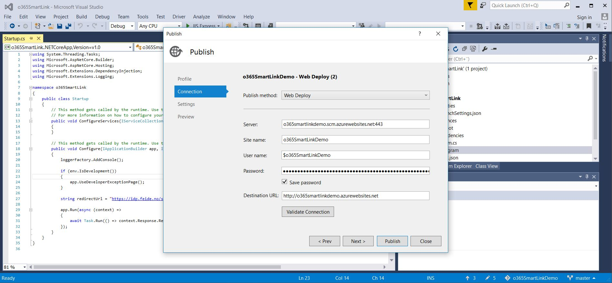

# App Services #

https://azure.microsoft.com/en-us/documentation/articles/app-service-value-prop-what-is/

App Service is a platform-as-a-service (PaaS) offering of Microsoft Azure. Create web and mobile apps for any platform or device. Integrate your apps with SaaS solutions, connect with on-premises applications, and automate your business processes

App Service includes the web and mobile capabilities that we previously delivered separately as Azure Websites and Azure Mobile Services. It also includes new capabilities for automating business processes and hosting cloud APIs. As a single integrated service, App Service lets you compose various components -- websites, mobile app back ends, RESTful APIs, and business processes -- into a single solution

## Deploy a VisualStudio ASP.NET Project to Web App ##

### Prepare configuration in the Azure portal ### 

- Go to: https://portal.azure.com
- Click "More Services" and search for and select "App Services"

- Click "Add"
- Give your Web App a name and link a resource group to the App Service
- Next thing to do is to link a "App Service Plan" to your App Service

`Resource groups provide a way to monitor, control access, provision and manage billing for collections of assets that are required to run an application, or used by a client or company department. Azure Resource Manager (ARM) is the technology that works behind the scenes so that you can administer assets using these logical containers.`

`An App Service plan represents a set of features and capacity that you can share across multiple apps. These plans support five pricing tiers: Free, Shared, Basic, Standard, and Premium. Each tier has its own capabilities and capacity.`

### In VisualStudio 2015 ###

- Open your ASP.NET Project in Visual Studio 2015 -> Build -> Publish <yourWebApp>

- Click "Microsoft Azure App Service"
- Add an account if not already done. The account must have access to the Azure Subscription you used when you created the Web App in the Azure portal.

- Select the App Service you created and click "OK"

- Click "Publish"

- Verify the VisualStudio Output -> Publish succeeded
- Your Web App should now be available at http://<yourAppName>.azurewebsites.net

## Links ##

https://blogs.msdn.microsoft.com/waws/2014/10/01/mapping-a-custom-subdomain-to-an-azure-website/ 
