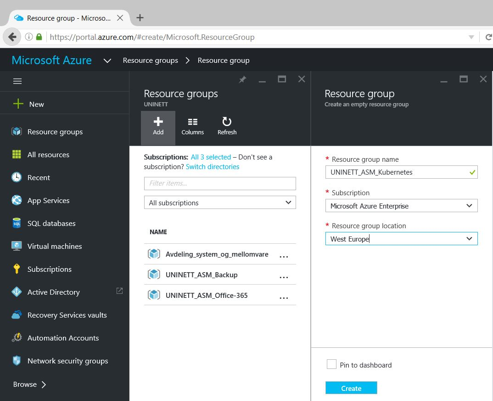
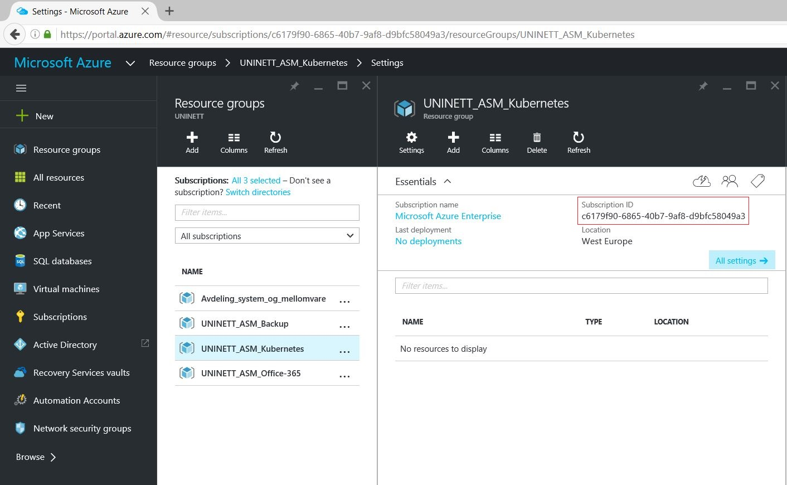
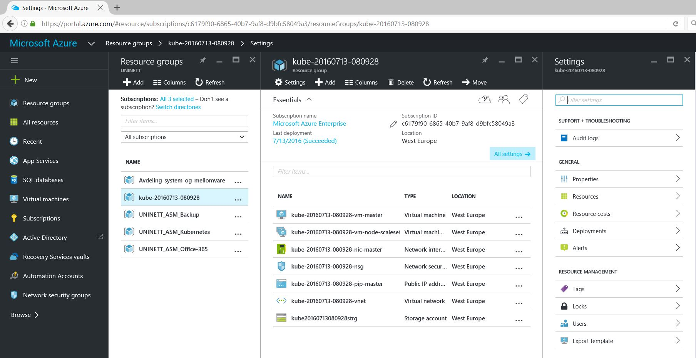

# Google Kubernetes Cluster on Azure #

http://kubernetes.io/

`Kubernetes is an open-source system for automating deployment, scaling, and management of containerized applications.`

Kubernetes is not a module in Azure -> This my experience with trying to follow the "Deployment guide on kubernetes.io" to setup a Kubernetes cluster in Azure.

## Create & Configure Linux Management Server/VM ##

First create & configure a Linux Server/VM that you can use to manage your Kubernetes Cluster.
This Server/VM can be on-premises (Physical HW or hypervisor) or on Azure VM (Or another public cload platform).

I choose to create a Debian 8.0 Jessie Linux VM on a on-premises HyperV-Cluster.

### Install Docker ###

https://docs.docker.com/v1.8/installation/debian/#debian-jessie-80-64-bit

	$ sudo apt-get update
	$ sudo apt-get install docker.io

### Install JQ ###

	apt-get install jq

### Install NodeJs ###

https://nodejs.org/en/download/package-manager/#debian-and-ubuntu-based-linux-distributions

	curl -sL https://deb.nodesource.com/setup_6.x | sudo -E bash -
	sudo apt-get install -y nodejs

### Install & Configure Kubectl ###

https://coreos.com/kubernetes/docs/latest/configure-kubectl.html

	$ curl -O https://storage.googleapis.com/kubernetes-release/release/v1.2.4/bin/linux/amd64/kubectl
	$ chmod +x kubectl
	$ mv kubectl /usr/local/bin/kubectl
	
## Prepare Azure ##

https://portal.azure.com/

Create a new Resource group to contain your Kubernetes cluster.

`Resource groups provide a way to monitor, control access, provision and manage billing for collections of assets that are required to run an application, or used by a client or company department. Azure Resource Manager (ARM) is the technology that works behind the scenes so that you can administer assets using these logical containers.`

Find your Subscription ID:

Find your AzureAD Tenant ID:

http://merill.net/2015/01/how-to-get-the-azure-ad-tenant-id-without-powershell/

## Flannel-based ##

http://kubernetes.io/docs/getting-started-guides/azure/

*Export environment variables*

	root@azure-kube:~# export KUBERNETES_PROVIDER=azure
	root@azure-kube:~# export AZURE_SUBSCRIPTION_ID="c6179f90-6865-40b7-9af8-d9bfc58049a3"
	root@azure-kube:~# export AZURE_TENANT_ID="68763e3d-4615-4222-988f-90ba13e351e9"
	root@azure-kube:~# export AZURE_RESOURCE_GROUP="UNINETT_ASM_Kubernetes"
	root@azure-kube:~# export AZURE_RESOURCE_GROUP_PARAM="UNINETT_ASM_Kubernetes"
	root@azure-kube:~# export AZURE_LOCATION="westeurope"
	root@azure-kube:~# export AZURE_AUTH_METHOD="device"

### Download Kubernetes ###

	root@azure-kube:~# curl -sS https://get.k8s.io | bash
	Downloading kubernetes release v1.3.0 to /root/kubernetes.tar.gz
	converted 'https://storage.googleapis.com/kubernetes-release/release/v1.3.0/kubernetes.tar.gz' (ANSI_X3.4-1968) -> 'https://storage.googleapis.com/kubernetes-release/release/v1.3.0/kubernetes.tar.gz' (UTF-8)
	--2016-07-13 07:41:47--  https://storage.googleapis.com/kubernetes-release/release/v1.3.0/kubernetes.tar.gz
	Resolving storage.googleapis.com (storage.googleapis.com)... 2a00:1450:400f:807::2010, 172.217.22.176
	Connecting to storage.googleapis.com (storage.googleapis.com)|2a00:1450:400f:807::2010|:443... connected.
	HTTP request sent, awaiting response... 200 OK
	Length: 1486828686 (1.4G) [application/x-tar]
	Saving to: 'kubernetes.tar.gz'
	
	kubernetes.tar.gz                               100%[======================================================================================================>]   1.38G  80.9MB/s   in 18s
	
	2016-07-13 07:42:07 (78.3 MB/s) - 'kubernetes.tar.gz' saved [1486828686/1486828686]
	
	Unpacking kubernetes release v1.3.0
	Creating a kubernetes on azure...
	... Starting cluster using provider: azure
	... calling verify-prereqs
	... calling kube-up
	++> AZURE KUBE-UP STARTED: Wed Jul 13 07:42:58 CEST 2016
	This will be interactive. (export AZURE_AUTH_METHOD=client_secret to avoid the prompt)
	hyperkube-amd64:v1.3.0 was found in the gcr.io/google_containers repository
	FATA[0000] cannot enable tty mode on non tty input
	root@azure-kube:~#

This one failes on authentication. 

### Start Kube-up ###

	root@azure-kube:~# cd kubernetes/cluster
	root@azure-kube:~/kubernetes/cluster# ./kube-up.sh
	... Starting cluster using provider: azure
	... calling verify-prereqs
	... calling kube-up
	++> AZURE KUBE-UP STARTED: Tue Jul 12 14:55:04 CEST 2016
	This will be interactive. (export AZURE_AUTH_METHOD=client_secret to avoid the prompt)
	hyperkube-amd64:v1.3.0 was found in the gcr.io/google_containers repository
	Unable to find image 'colemickens/azkube:v0.0.5' locally
	v0.0.5: Pulling from colemickens/azkube
	9b6bb6833201: Pull complete
	17598223c915: Pull complete
	5c7358615129: Pull complete
	6363b3ae1157: Pull complete
	2655c2e7835c: Pull complete
	Digest: sha256:0f9867e2ccb9197ea1b4e93958f8cda85e66e16ed1a0930ce0f4b09a25d68547
	Status: Downloaded newer image for colemickens/azkube:v0.0.5
	Forcing use of resource group UNINETT_ASM_Kubernetes
	WARN[0000] --resource-group is unset. Derived one from --deployment-name: "kube-20160713-080928"
	WARN[0000] --master-fqdn is unset. Derived one from input: "kube-20160713-080928.westeurope.cloudapp.azure.com".
	To sign in, use a web browser to open the page https://aka.ms/devicelogin. Enter the code C27YY9N2J to authenticate.

In a web-browser (On your PC/or any device) open the URL https://aka.ms/devicelogin and enter the code the script generates for you.

Click "Continue" and then you will be asked to authenticate with your Azure user.
When this is done, the script will continue to run.

	INFO[0101] Starting ARM Deployment. This will take some time. deployment="kube-20160713-080928-1468390271"
	INFO[0342] Finished ARM Deployment. deployment="kube-20160713-080928-1468390271"
	INFO[0342] Validating Kubernetes cluster.
	WARN[0342] Failed to validate components: Get https://kube-20160713-080928.westeurope.cloudapp.azure.com:6443/api/v1/componentstatuses: dial tcp 23.97.150.57:6443: getsockopt: connection re                          fused
	INFO[0357] Validating Kubernetes cluster.
	WARN[0358] Failed to validate components: Get https://kube-20160713-080928.westeurope.cloudapp.azure.com:6443/api/v1/componentstatuses: dial tcp 23.97.150.57:6443: getsockopt: connection re                          fused
	INFO[0373] Validating Kubernetes cluster.
	WARN[0379] Failed to validate node count: validate: incorrect healthy count. expected=3 actual=2
	INFO[0394] Validating Kubernetes cluster.
	WARN[0394] Failed to validate node count: node not ready. node="kube-20160713-080928-vm-node-1" status="False" message="container runtime is down" reason="KubeletNotReady"
	INFO[0409] Validating Kubernetes cluster.
	WARN[0410] validate: incorrect healthy count. expected=3 actual=4
	INFO[0410] Deployment Complete!
	INFO[0410] master: "https://kube-20160713-080928.westeurope.cloudapp.azure.com:6443"
	INFO[0410] output: "/opt/azkube/_deployments/kube-20160713-080928"
	cluster "kube-20160713-080928" set.
	user "kube-20160713-080928_user" set.
	context "kube-20160713-080928" set.
	switched to context "kube-20160713-080928".
	Error from server: error when creating "STDIN": namespaces "kube-system" already exists
	root@azure-kube:~/kubernetes/cluster#

Some warnings and errors in this output. Let`s look into the Azure Portal.

Looks like that the created Resource group "UNINETT_ASM_Kubernetes" is not used. Instead a new resource group "kube-20160713-080928" is created.
This was working for some weeks ago, so something has changed.

	root@azure-kube:~/kubernetes/cluster# cd azure/
	root@azure-kube:~/kubernetes/cluster/azure# cd _deployments/
	root@azure-kube:~/kubernetes/cluster/azure/_deployments# ls -lrt
	total 4
	drwxr-xr-x 2 root root 4096 Jul 13 08:11 kube-20160713-080928
	root@azure-kube:~/kubernetes/cluster/azure/_deployments# cd kube-20160713-080928

*This alters the current kubectl configuration to point at this cluster*

	root@azure-kube:~/kubernetes/cluster/azure/_deployments/kube-20160713-080928# ./util.sh configure-kubectl
	Using system's kubectl: /usr/local/bin/kubectl
	cluster "kube-20160713-080928" set.
	user "kube_user" set.
	context "kube-20160713-080928" set.
	switched to context "kube-20160713-080928".
	root@azure-kube:~/kubernetes/cluster/azure/_deployments/kube-20160713-080928#

*Copy the private key itself to the master node*

	root@azure-kube:~/kubernetes/cluster/azure/_deployments/kube-20160713-080928# ./util.sh copykey
	Using system's kubectl: /usr/local/bin/kubectl
	The authenticity of host 'kube-20160713-080928.westeurope.cloudapp.azure.com (23.97.150.57)' can't be established.
	ECDSA key fingerprint is 7f:98:5f:37:78:d4:4a:37:0a:99:e4:96:15:2a:6a:4e.
	Are you sure you want to continue connecting (yes/no)? yes
	Warning: Permanently added 'kube-20160713-080928.westeurope.cloudapp.azure.com,23.97.150.57' (ECDSA) to the list of known hosts.
	kube_rsa                                                                                                                                                                             100% 3243     3.2KB/s   00:00

*SSH into master*

	root@azure-kube:~/kubernetes/cluster/azure/_deployments/kube-20160713-080928#
	root@azure-kube:~/kubernetes/cluster/azure/_deployments/kube-20160713-080928# ./util.sh ssh
	Using system's kubectl: /usr/local/bin/kubectl
	CoreOS beta (1068.3.0)
	Last login: Wed Jul 13 06:24:35 2016 from 158.38.212.208
	kube@kube-20160713-080928-vm-master ~ $ exit
	Connection to kube-20160713-080928.westeurope.cloudapp.azure.com closed.

*Try some kubectl commands*

	root@azure-kube:~/kubernetes/cluster/azure/_deployments/kube-20160713-080928# kubectl get nodes
	NAME                             STATUS                     AGE
	kube-20160713-080928-vm-master   Ready,SchedulingDisabled   18m
	kube-20160713-080928-vm-node-0   Ready                      18m
	kube-20160713-080928-vm-node-1   Ready                      18m
	kube-20160713-080928-vm-node-2   Ready                      18m
	root@azure-kube:~/kubernetes/cluster/azure/_deployments/kube-20160713-080928# kubectl get services
	NAME         CLUSTER-IP   EXTERNAL-IP   PORT(S)   AGE
	kubernetes   10.3.0.1     <none>        443/TCP   18m
	root@azure-kube:~/kubernetes/cluster/azure/_deployments/kube-20160713-080928# kubectl cluster-info
	Kubernetes master is running at https://kube-20160713-080928.westeurope.cloudapp.azure.com:6443
	root@azure-kube:~/kubernetes/cluster/azure/_deployments/kube-20160713-080928#

### Weave-based ###

http://kubernetes.io/docs/getting-started-guides/coreos/azure/

